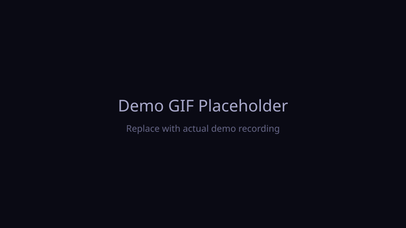

```
╔════════════════════════════════════════════════════════════╗
║     HyprGlass Studio — Liquid Glass for Hyprland          ║
╚════════════════════════════════════════════════════════════╝
```

> Real-time Liquid Glass effects for the Hyprland Wayland compositor.

# HyprGlass Studio

[](LICENSE)
[](https://github.com/Spacecer2/hyprglass-studio)
[](https://github.com/Spacecer2/hyprglass-studio/issues)
[](https://github.com/Spacecer2/hyprglass-studio/commits/master)
[](https://hyprland.org)
[](https://www.python.org)

> Apple-style Liquid Glass effects for your Hyprland desktop on Linux.

---

## What is HyprGlass Studio?

HyprGlass Studio brings the translucent, depth-aware glass aesthetic introduced in Apple's Liquid Glass design language to the Hyprland Wayland compositor. It applies real-time blur, tint, and transparency to windows and layer surfaces, syncs colors from your wallpaper, and gives you a browser-based Studio UI to tune every parameter live.

---

## Vision

HyprGlass Studio is more than a blur plugin — it's a step toward a future where your desktop feels alive, adaptive, and unmistakably yours.

- **Short-term (v1.x):** Rock-solid stability, polished profiles, and seamless [wallust](https://codeberg.org/explosion-mental/wallust) color syncing that makes every wallpaper feel like a fresh theme.
- **Mid-term (v2.x):** A ground-up plugin rewrite for better performance, lower latency, and deeper Wayland-native integration — starting with Hyprland and growing from there.
- **Long-term (v3.x+):** AI-powered adaptive glass that reads context and mood, a community marketplace for one-click profiles, and first-class support for the broader Wayland compositor ecosystem.

The goal is simple: **glass that knows you.**

---

## Roadmap

See [ROADMAP.md](ROADMAP.md) for planned features, milestones, and current status.

---

## Version Planning

Release goals and version targets are tracked in [ROADMAP.md](ROADMAP.md#version-planning).

---

## Demo

<!-- Replace with an actual screen recording GIF -->


---

## Features

- 🪟 **Glass Effect on Windows & Layer Surfaces** — Apply blur, opacity, and color tint to any window or layer-shell surface in real time.
- 🎨 **Wallust Color Sync** — Automatically extract dominant colors from your wallpaper and use them to tint glass surfaces for a cohesive look.
- 🔀 **Session Profiles** — Switch between presets like *Gaming*, *Coding*, and *Movies* with a single command or hotkey.
- 🖥️ **Web-based Studio UI** — A local dashboard for live-tuning glass parameters, previewing changes, and exporting configs.
- 🔄 **Auto-Switching** — Automatically apply the right profile based on the active application (e.g. game detected → Gaming profile).
- 🤝 **JaKooLit Dots Compatible** — Works out of the box with [JaKooLit's Hyprland dots](https://github.com/JaKooLit/Hyprland-Dots).

---

## Screenshots

<!-- Replace the paths below with actual screenshots -->

| Glass Effect | Studio UI | Profile Switch |
|:---:|:---:|:---:|
|  |  |  |

---

## Requirements

| Dependency | Version | Notes |
|---|---|---|
| **Hyprland** | ≥ 0.55 | Required |
| **hyprpm** | latest | Hyprland plugin manager |
| **Python** | ≥ 3.8 | Core runtime |
| **wallust** | latest | Optional — for wallpaper color sync |

---

## Installation

### Quick install

For security, review the install script before running it. You can download it first, inspect it, and then execute it locally:

```bash
# Download the installer
curl -fsSL -o /tmp/hyprglass-install.sh \
    https://raw.githubusercontent.com/Spacecer2/hyprglass-studio/master/install.sh

# Inspect the script (recommended)
less /tmp/hyprglass-install.sh

# Run it
bash /tmp/hyprglass-install.sh
```

### Manual install

```bash
git clone https://github.com/Spacecer2/hyprglass-studio.git ~/hyprglass-studio
cd ~/hyprglass-studio
./install.sh
```

The install script will:

- Check for Hyprland, `hyprpm`, and Python
- Build and install the Hyprland glass plugin via `hyprpm`
- Install the Python package and CLI entry point
- Optionally enable the user service for auto-start

### JaKooLit Hyprland dots

If you use [JaKooLit's Hyprland dots](https://github.com/JaKooLit/Hyprland-Dots), HyprGlass Studio is compatible out of the box. The installer detects the JaKooLit layout and adds the default keybindings and startup hook to `~/.config/hypr/UserConfigs/Startup_Apps.conf`. If you prefer to manage startup manually, skip the service option during install.

### Verification

After installation, confirm everything is in place:

```bash
# Confirm the Hyprland plugin is loaded
hyprpm list | grep -i hyprglass

# Confirm the profile switcher is installed
~/.config/hypr/scripts/HyprglassProfile.sh list

# Check the installation health
~/.config/hypr/scripts/CheckHyprglassStatus.sh
```

---

## Quick Start

**1. Launch the Studio UI**

If you installed via `make install` / package:

```bash
hyprglass-studio
```

From the repository directly:

```bash
cd ~/hyprglass-studio
python3 -m src.server --port 8765
```

**2. Open your browser**

Navigate to `http://localhost:8765` to tune blur, opacity, tint, layer surfaces, and window rules in real time.

**3. Try a profile**

```bash
~/.config/hypr/scripts/HyprglassProfile.sh apply gaming
```

---

## Documentation

- [Configuration Reference](docs/CONFIGURATION.md)
- [Profiles Guide](docs/PROFILES.md)
- [Auto-Switching Setup](docs/PROFILES.md#auto-switching)
- [Wallust Integration](docs/WALLUST-INTEGRATION.md)
- [Building from Source](docs/INSTALLATION.md)
- [Roadmap](ROADMAP.md)
- [Version Planning](ROADMAP.md#version-planning)
- [Contributing](CONTRIBUTING.md)

---

## Contributing

Contributions are welcome! Please read [CONTRIBUTING.md](CONTRIBUTING.md) for guidelines on how to report issues, propose features, and submit changes.

---

## Star History

View the [star history](https://star-history.com/#Spacecer2/hyprglass-studio&Date) for this project.

---

## License

MIT — see [LICENSE](LICENSE) for details.
