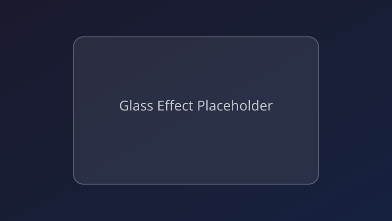
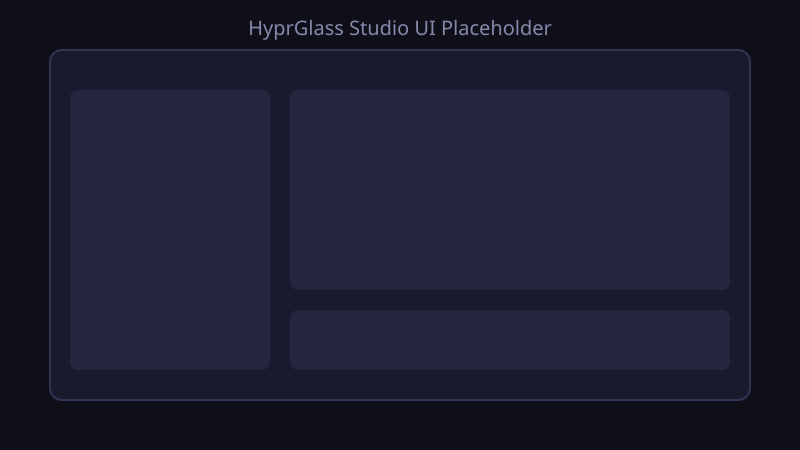
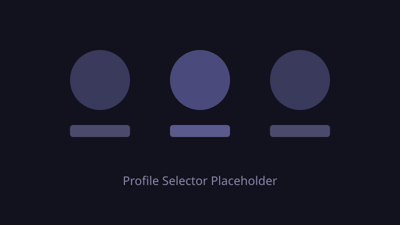

# HyprGlass Studio — Web Interface

> Live-tuning dashboard for the HyprGlass glass-effect engine.

---

## Table of Contents

- [Overview](#overview)
- [Launching the Studio](#launching-the-studio)
- [Interface Walkthrough](#interface-walkthrough)
  - [Header Bar](#header-bar)
  - [Global Settings](#global-settings)
  - [Glass Effect Tuning](#glass-effect-tuning)
  - [Dark / Light Theme Tuning](#dark--light-theme-tuning)
  - [Layer Surfaces](#layer-surfaces)
  - [Decoration Overrides](#decoration-overrides)
  - [Window Rules Editor](#window-rules-editor)
- [Buttons & Actions](#buttons--actions)
- [Profile Management](#profile-management)
- [Theme Toggle](#theme-toggle)
- [API Reference](#api-reference)
- [How Configuration is Written](#how-configuration-is-written)
- [Preserving `default_preset`](#preserving-default_preset)
- [Troubleshooting](#troubleshooting)

---

## Overview

HyprGlass Studio is a local web UI that lets you adjust every HyprGlass parameter in real time, preview changes in a live kitty terminal window, and persist your settings to `Hyprglass.conf` with a single click. It runs as a lightweight Python HTTP server — no external dependencies beyond the standard library.

<!-- Screenshot placeholder -->


---

## Launching the Studio

### Option A — Wrapper script

```bash
cd ~/hyprglass-studio
./launch.sh
```

`launch.sh` resolves the project root, activates any virtual-env if present, and starts the server on the default port **8765**.

### Option B — Direct Python invocation

```bash
python3 server.py --port 8765
```

Any free port works:

```bash
python3 server.py --port 9000
```

Once running, open the displayed URL in any browser:

```
http://localhost:8765
```

<!-- Screenshot placeholder -->


---

## Interface Walkthrough

The UI is organised into collapsible sections on a single scrollable page.

### Header Bar

| Element | Description |
|---|---|
| **HyprGlass Studio** title | Branding — not interactive |
| **Profile selector** | Dropdown to load / switch saved profiles |
| **Theme toggle** | Switch between the Studio's own dark and light chrome |
| **Apply** | Write current settings to `Hyprglass.conf` and reload Hyprland |
| **Preview** | Send a non-destructive live preview to the kitty window |
| **Reset** | Revert all controls to the values loaded from disk |

<!-- Screenshot placeholder -->


---

### Global Settings

Top-level toggles that control HyprGlass behaviour at the compositor level.

| Control | Type | Default | Description |
|---|---|---|---|
| `enabled` | checkbox | `true` | Master switch — disables all glass effects when unchecked |
| `preset` | dropdown | `default` | Built-in preset loaded at startup |
| `theme` | dropdown | `auto` | Force dark, light, or follow system (`auto`) |

---

### Glass Effect Tuning

The core visual parameters. All sliders update the live preview in real time.

| Control | Range | Default | Description |
|---|---|---|---|
| `blur_size` | 1 – 50 | 20 | Gaussian blur kernel radius |
| `blur_passes` | 1 – 10 | 3 | Number of blur passes (more = heavier) |
| `refraction_strength` | 0.0 – 1.0 | 0.45 | How much light bends through the glass |
| `chromatic_aberration` | 0.0 – 1.0 | 0.12 | Colour fringing at glass edges |
| `fresnel_intensity` | 0.0 – 1.0 | 0.65 | Edge-brightness falloff (Fresnel effect) |
| `tint_opacity` | 0 – 100 | 18 | Opacity of the colour tint overlay (%) |
| `noise_grain` | 0.0 – 1.0 | 0.03 | Subtle grain texture on the glass surface |

<!-- Screenshot placeholder -->


---

### Dark / Light Theme Tuning

Separate colour palettes for each system theme. The active set depends on the `theme` global setting.

#### Dark theme defaults

| Control | Default |
|---|---|
| `bg_tint` | `rgba(30, 30, 40, 0.18)` |
| `border_color` | `rgba(255, 255, 255, 0.08)` |
| `shadow_color` | `rgba(0, 0, 0, 0.35)` |

#### Light theme defaults

| Control | Default |
|---|---|
| `bg_tint` | `rgba(255, 255, 255, 0.22)` |
| `border_color` | `rgba(0, 0, 0, 0.06)` |
| `shadow_color` | `rgba(0, 0, 0, 0.12)` |

Each colour field accepts CSS-style `rgba(...)` strings.

---

### Layer Surfaces

Configure which layer-shell surfaces (bars, notifications, overlays) receive glass effects.

| Control | Type | Description |
|---|---|---|
| `waybar` | checkbox | Apply glass to Waybar |
| `notifications` | checkbox | Apply glass to notification popups |
| `lock_screen` | checkbox | Apply glass to the lock screen overlay |
| `layer_blur` | slider (0–50) | Dedicated blur radius for layer surfaces |
| `layer_opacity` | slider (0–100) | Opacity percentage for layer surfaces |

---

### Decoration Overrides

Override Hyprland's `decoration` section values when HyprGlass is active.

| Control | Range | Description |
|---|---|---|
| `active_opacity` | 0.0 – 1.0 | Window opacity when focused |
| `inactive_opacity` | 0.0 – 1.0 | Window opacity when unfocused |
| `fullscreen_opacity` | 0.0 – 1.0 | Window opacity when fullscreen |
| `rounding` | 0 – 50 | Corner radius override (pixels) |

---

### Window Rules Editor

A rule-based system for per-app glass overrides. The editor exposes a textarea where each line is a Hyprland-style window rule.

**Format:**

```
windowrulev2 = opacity 0.9 0.7, class:^(kitty)$
windowrulev2 = opacity 0.85 0.65, class:^(firefox)$
windowrulev2 = opaque, class:^(mpv)$
```

Rules are validated client-side before being sent to the server. Invalid lines are highlighted in red.

---

## Buttons & Actions

| Button | Behaviour |
|---|---|
| **Preview** | Sends a `POST /api/preview` with the current form state. The kitty preview window updates immediately. No files are modified. |
| **Apply** | Sends a `POST /api/apply`. The server writes the full configuration to `Hyprglass.conf` and triggers `hyprctl reload`. |
| **Reset** | Re-fetches `GET /api/config` and repopulates every control with the values currently on disk. Discards unsaved changes. |

---

## Profile Management

Profiles are saved snapshots of every Studio parameter.

- **Save** — Type a name in the profile input and click *Save*. The server writes a JSON file to `profiles/<name>.json`.
- **Load** — Select a profile from the dropdown. All controls update and a preview is triggered automatically.
- **Delete** — Click the × icon next to a profile name. The server removes `profiles/<name>.json`.

<!-- Screenshot placeholder -->


---

## Theme Toggle

The Studio UI itself supports a dark and light chrome theme, independent of the glass-effect theme being configured. Click the sun/moon icon in the header bar to switch. The preference is stored in `localStorage` and persists across sessions.

---

## API Reference

All endpoints accept and return `application/json`.

### `GET /api/health`

Returns server status and version.

```bash
curl http://localhost:8765/api/health
```

**Response:**

```json
{
  "status": "ok",
  "version": "1.0.0",
  "config_path": "/home/neo/.config/hypr/Hyprglass.conf"
}
```

---

### `GET /api/config`

Returns the full configuration object currently loaded in memory.

```bash
curl http://localhost:8765/api/config
```

**Response (abbreviated):**

```json
{
  "enabled": true,
  "preset": "default",
  "theme": "auto",
  "glass": {
    "blur_size": 20,
    "blur_passes": 3,
    "refraction_strength": 0.45,
    "chromatic_aberration": 0.12,
    "fresnel_intensity": 0.65,
    "tint_opacity": 18,
    "noise_grain": 0.03
  },
  "dark_theme": {
    "bg_tint": "rgba(30, 30, 40, 0.18)",
    "border_color": "rgba(255, 255, 255, 0.08)",
    "shadow_color": "rgba(0, 0, 0, 0.35)"
  },
  "light_theme": {
    "bg_tint": "rgba(255, 255, 255, 0.22)",
    "border_color": "rgba(0, 0, 0, 0.06)",
    "shadow_color": "rgba(0, 0, 0, 0.12)"
  },
  "layer_surfaces": {
    "waybar": true,
    "notifications": true,
    "lock_screen": false,
    "layer_blur": 15,
    "layer_opacity": 90
  },
  "decoration": {
    "active_opacity": 0.92,
    "inactive_opacity": 0.78,
    "fullscreen_opacity": 1.0,
    "rounding": 12
  },
  "window_rules": [
    "windowrulev2 = opacity 0.9 0.7, class:^(kitty)$"
  ]
}
```

---

### `POST /api/preview`

Sends the provided parameters to the live preview window without writing any files.

```bash
curl -X POST http://localhost:8765/api/preview \
  -H "Content-Type: application/json" \
  -d '{
    "glass": {
      "blur_size": 25,
      "refraction_strength": 0.5
    }
  }'
```

**Response:**

```json
{
  "status": "preview_updated",
  "applied": ["glass.blur_size", "glass.refraction_strength"]
}
```

Only keys present in the request body are overridden — omitted keys retain their current values.

---

### `POST /api/apply`

Writes the full configuration to `Hyprglass.conf` and reloads Hyprland.

```bash
curl -X POST http://localhost:8765/api/apply \
  -H "Content-Type: application/json" \
  -d '{
    "enabled": true,
    "preset": "default",
    "glass": {
      "blur_size": 20,
      "blur_passes": 3,
      "refraction_strength": 0.45,
      "chromatic_aberration": 0.12,
      "fresnel_intensity": 0.65,
      "tint_opacity": 18,
      "noise_grain": 0.03
    }
  }'
```

**Response:**

```json
{
  "status": "applied",
  "config_path": "/home/neo/.config/hypr/Hyprglass.conf",
  "reloaded": true
}
```

---

## How Configuration is Written

When **Apply** is clicked:

1. The server serialises the in-memory config dict into the HyprGlass TOML/conf format.
2. An atomic write is performed — the new content is written to a temporary file, `fsync`'d, then renamed over the target path. This prevents partial writes on crash.
3. `hyprctl reload` is executed to make Hyprland pick up the new settings.
4. The response is returned to the client.

The configuration file path is determined at startup and printed in the health endpoint. By default:

```
~/.config/hypr/Hyprglass.conf
```

---

## Preserving `default_preset`

`server.py` contains an explicit guard to ensure the `default_preset` key is never overwritten by user edits:

```python
# In server.py — apply handler
def apply_config(new_config: dict) -> dict:
    current = load_config()

    # Preserve the original default_preset — users must not change this via the UI
    if "default_preset" in current:
        new_config["default_preset"] = current["default_preset"]

    # ... write new_config to disk ...
```

This means:

- `default_preset` is read once at startup from the existing `Hyprglass.conf`.
- The Studio UI does not expose a control for it.
- If `default_preset` is absent from the on-disk config (fresh install), it is set to `"default"` automatically.
- Every Apply call copies the original value into the new config before writing, guaranteeing it survives any number of UI edits.

---

## Troubleshooting

| Problem | Fix |
|---|---|
| Server won't start — port in use | `python3 server.py --port <other>` or kill the process on the occupied port |
| Preview doesn't update | Ensure kitty is running and the preview window PID is valid — restart the server to re-detect |
| Apply has no visual effect | Run `hyprctl reload` manually; check `Hyprglass.conf` for syntax errors |
| Profile won't save | Verify the `profiles/` directory exists and is writable |
| Config file path is wrong | The server reads `HYPRLAND_CONFIG_DIR` or falls back to `~/.config/hypr/` |

---

## Screenshots

<!-- Replace placeholder paths with actual images -->

| Glass Effect | Studio UI | Profile Switch |
|:---:|:---:|:---:|
|  |  |  |

| Window Rules | Theme Toggle | API Health |
|:---:|:---:|:---:|
|  |  |  |
